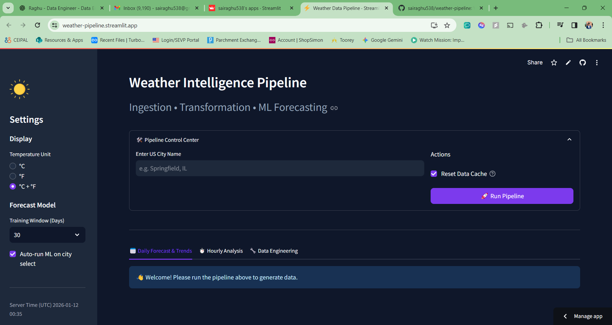
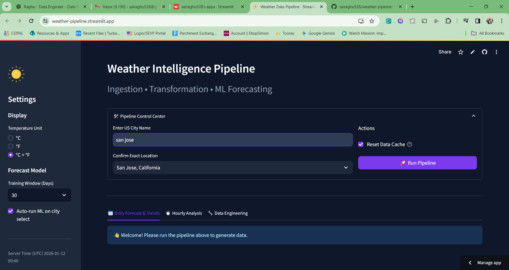
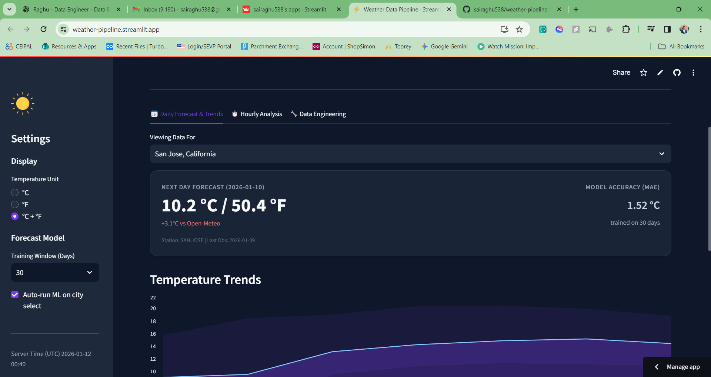
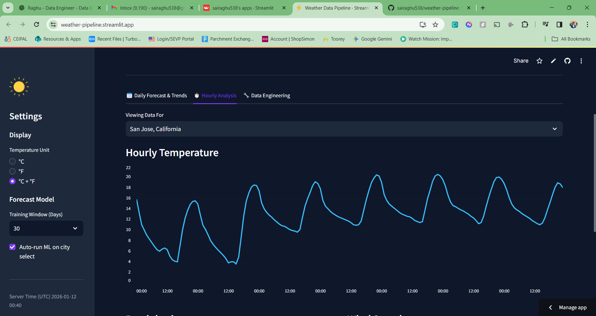
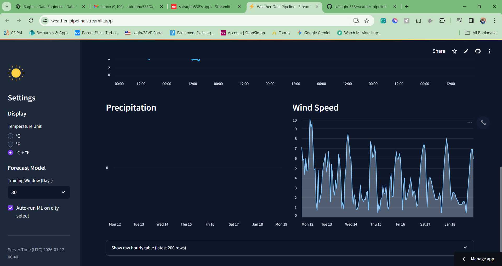
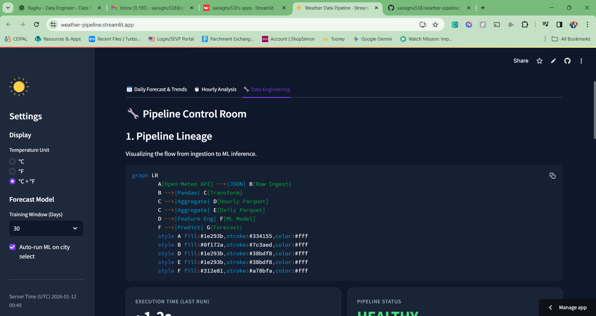
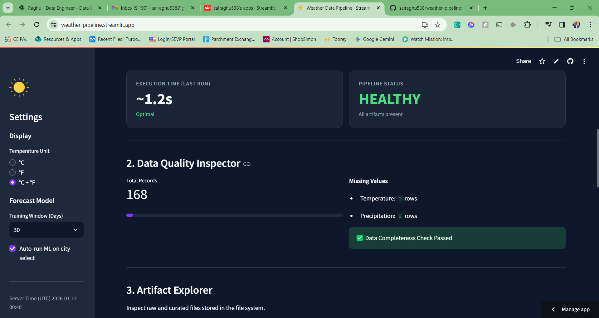
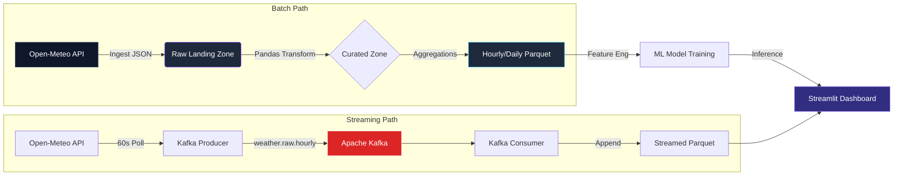

# ⚡ Weather Intelligence Pipeline

[](https://www.python.org/)
[](https://streamlit.io/)
[](https://pandas.pydata.org/)
[](https://altair-viz.github.io/)

> **A modern, end-to-end data engineering project featuring a "Glassmorphism" UI, automated pipeline lineage, and hybrid ML forecasting.**

---

## 🚀 Overview

The **Weather Intelligence Pipeline** is a robust data engineering showcase that ingests, transforms, and visualizes weather data in real-time. Unlike standard dashboards, this project focuses on **Pipeline Observability** and **Data Quality**, providing a "Control Room" experience for monitoring ingestion flows and artifact integrity.

It combines **Open-Meteo** API data with a custom **NOAA-trained ML model** to provide unique, hybrid forecasts with accuracy tracking.

<!-- User can add screenshot here -->









<!--  -->

---

## ✨ Key Features

### 🔧 1. Data Engineering Suite
A dedicated "Control Room" tab provides deep visibility into the backend processes:
- **Visual Pipeline Lineage**: Real-time Mermaid DAG showing data flow from API to Parquet.
- **Execution Telemetry**: Trace execution time and status for every run.
- **Artifact Explorer**: Built-in JSON and Parquet viewer to inspect raw vs curated data without leaving the UI.
- **Data Quality Inspector**: Automated checks for null values, data freshness, and completeness.

### 📊 2. Interactive Analytics
- **Daily & Hourly Views**: Switch between long-term trends and high-resolution hourly data.
- **Multi-Metric Visualization**:
    - Temperature Trends (Area Charts)
    - Precipitation Levels (Bar Charts)
    - Wind Patterns (Area/Line Charts)
- **Dynamic Filtering**: Instant city search with geocoding and history.

### 🤖 3. Hybrid ML Forecasting
- **Proprietary Model**: Trains a light-weight regression model on 30/90/365 days of historical data from NOAA GHCN stations.
- **Model vs API Comparison**: Benchmarks the custom ML prediction against Open-Meteo's forecast to surface divergences.
- **Transparent Accuracy**: Displays Mean Absolute Error (MAE) and training metadata for every prediction.

---

## 🏗️ Architecture

The pipeline follows a modern **Lambda Architecture** with both batch and streaming paths:



1.  **Batch Ingest**: Fetches raw hourly weather data on-demand (Open-Meteo).
2.  **Streaming Ingest**: Kafka producer polls 50 US cities every 60 seconds.
3.  **Transform**: Cleanses data, handles type casting, and standardizes timestamps.
4.  **Store**: Saves artifacts as optimized **Parquet** files.
5.  **Serve**: Streamlit loads both batch and streamed data for visualization.

---

## 📡 Real-Time Streaming (Kafka)

This project features a **near real-time streaming pipeline** using Apache Kafka:

### Features
- ⚡ **100 US Cities** streaming simultaneously
- 🔄 **15-minute polling** (API rate limit safe: ~9,600 calls/day)
- 📊 **Live Dashboard** with auto-refresh and city filter
- 🔥 **Temperature Alerts** (Heat > 35°C, Cold < 0°C)
- 🟢 **Data Freshness Indicator** (Fresh/Stale/Old)


*Live Stream tab showing real-time data with city filter and temperature charts*


*100 US cities streaming simultaneously with auto-refresh*

### Running the Streaming Pipeline

```powershell
# Terminal 1: Zookeeper
cd kafka_native/kafka && ./start_zookeeper.ps1

# Terminal 2: Kafka Broker
cd kafka_native/kafka && ./start_kafka.ps1

# Terminal 3: Producer (100 cities)
cd streaming && python producer.py

# Terminal 4: Consumer
cd streaming && python consumer.py
```

### Streaming Architecture
| Component | Description |
|-----------|-------------|
| `producer.py` | Polls Open-Meteo for 100 cities every 15 min |
| `consumer.py` | Reads from Kafka, writes to Parquet |
| `cities.json` | List of 100 major US cities |
| Kafka Topic | `weather.raw.hourly` |


---

## 🛠️ Tech Stack

- **Core**: Python 3.10+
- **Streaming**: Apache Kafka 3.6.1 (ZooKeeper mode)
- **Data Processing**: Pandas, NumPy, PyArrow
- **Visualization**: Altair (Declarative Statistical Visualization)
- **App Framework**: Streamlit (with Custom CSS/Glassmorphism)
- **External APIs**: Open-Meteo (Weather), NOAA GHCN (ML Training)

---

## ⚡ Getting Started

### Prerequisites
- Python 3.8 or higher

### Installation

1.  **Clone the repository**
    ```bash
    git clone https://github.com/sairaghu538/weather-pipeline.git
    cd weather-pipeline
    ```

2.  **Create a virtual environment**
    ```bash
    python -m venv .venv
    # Windows
    .venv\Scripts\activate
    # Mac/Linux
    source .venv/bin/activate
    ```

3.  **Install dependencies**
    ```bash
    pip install -r requirements.txt
    ```

4.  **Run the application**
    ```bash
    streamlit run app.py
    ```

---

## 📂 Project Structure

```text
.
├── app.py                   # Main Streamlit Dashboard
├── pipeline/                # Batch ETL Logic
│   ├── config.py            # Configuration constants
│   ├── ingest.py            # API fetching & Raw storage
│   ├── transform.py         # Pandas transformations
│   └── weather_ml.py        # NOAA ML Model & Inference
├── streaming/               # Kafka Streaming Pipeline
│   ├── producer.py          # Multi-city Kafka producer
│   ├── consumer.py          # Kafka to Parquet consumer
│   └── cities.json          # 50 US cities with coordinates
├── kafka_native/            # Kafka installation & scripts
│   ├── setup_kafka.ps1      # Kafka setup script
│   └── kafka/               # Kafka binaries
├── data/                    # Local data storage
│   ├── raw/                 # JSON Landing Zone
│   ├── curated/             # Batch Parquet Tables
│   └── streamed/            # Kafka-streamed Parquet
├── .streamlit/              # App theming
└── requirements.txt         # Python dependencies
```